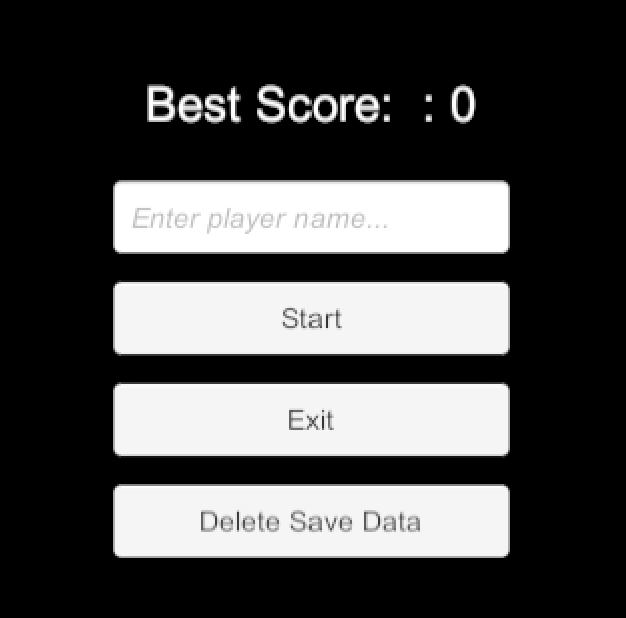
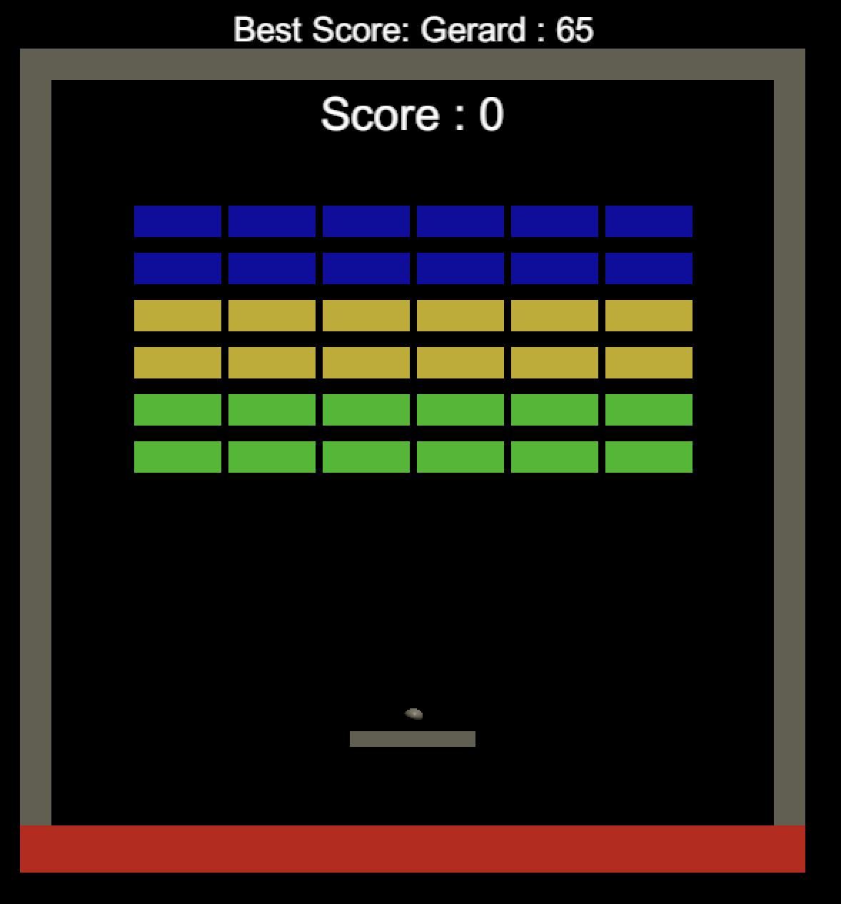

# Unity Architecture sample; Scene flow and Data Persistence on a Breakout-like game

Basic implementation of a persistence data system between scenes and sessions using an event-driven architecture based on Scriptable Objects.

Showcase use of Scriptable Objects, Modular SaveSystem, Addressable, Assembly Definition files and other good programming practices.

Inspired by the following work:
- Unity Open Project -  [ChopChop](https://github.com/UnityTechnologies/open-project-1)
- Unite Austin 2017 - [Game Architecture with Scriptable Objects](https://www.youtube.com/watch?v=raQ3iHhE_Kk) with Ryan Hipple

This showcase is intended to spotlight exemplary game architecture practices, designed for advanced programmers who wish to elevate their skills further.

## Disclaimer
Please note that the main focus of this demo is to highlight best practices in game architecture, specifically in the implementation of a persistence data system, event-driven architecture, and utilization of Scriptable Objects, among others. Consequently, elements like gameplay logic, art, and UI may not be polished to high standards. 
